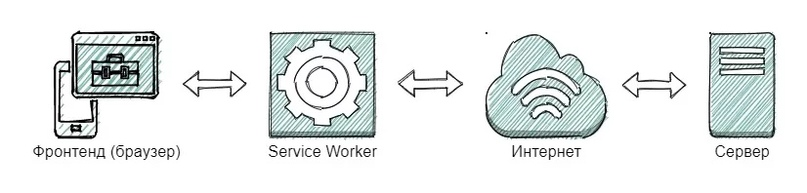
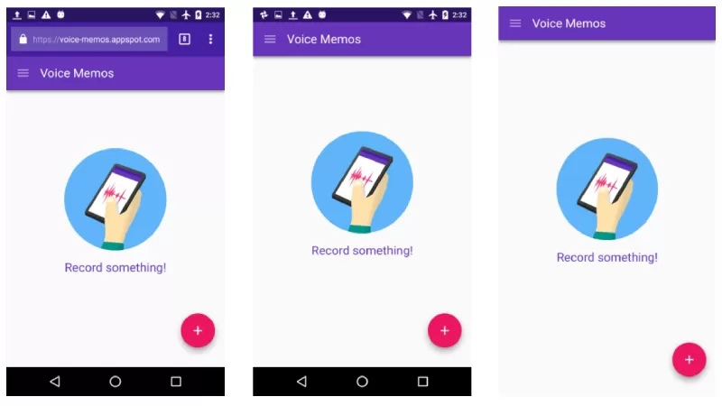

# Что такое PWA?

PWA (Progressive Web App) — это веб-приложение, которое использует современные веб-технологии для обеспечения опыта, аналогичного нативным приложениям. PWA может работать офлайн, отправлять push-уведомления и устанавливаться на домашний экран устройства.

## PWA должен обладать следующими пунктами, чтобы считаться PWA

1. **Доступность**:
   - Работает для каждого пользователя, независимо от выбора браузера.

2. **Независимость**:
   - Использует сервис-воркеры для работы офлайн.

3. **Обновляемость**:
   - Всегда актуально благодаря обновлениям через сервис-воркеры.

4. **Безопасность**:
   - Использует HTTPS для предотвращения вмешательства и обеспечения безопасности контента.

5. **Установка**:
   - Может быть установлено на домашний экран без необходимости в магазине приложений.

6. **Вовлеченность**:
   - Поддерживает push-уведомления и другие функции, которые делают приложение более интерактивным.


## Плюсы PWA

 - **+** Работает с камерой, bluetooth, датчиками и другим «железом».
 - **+** Занимает мало памяти на устройстве – в среднем до 1 Мб.
 - **+** Иконку PWA можно добавить на домашний экран смартфона вместе с приложениями из AppStore и Google Play.
 - **+** PWA адаптируется к экранам мобильных, планшетов, ноутбуков и ПК.
 - **+** SEO оптимизация - так как PWA индексируется поисковыми роботами.
 - **+** Мгновенная загрузка

## Минусы PWA

 - **-** не все устройства поддерживают PWA из-за особенностей версии ОС
 - **-** нельзя отправлять пуши на iOS из-за ограничений платформы зависимость от браузера
 - **-** увеличенный расход батареи по сравнению с сёрфингом в браузере
 ограниченные возможности

## Когда уместно разрабатывать PWA

PWA стоит рассматривать как альтернативу мобильному приложению. Везде, где нет сложной логики, оно будет отличной заменой.

Например, в виде PWA можно сделать форму заказа на сайте компании по доставке воды. Клиентам не нужно будет искать сайт поставщика – достаточно запустить форму с домашнего экрана смартфона и сделать заказ.

Личный кабинет для интернет-магазина тоже можно выделить как PWA. В таком приложении будет удобно просматривать статусы заказов и решать другие часто повторяющиеся задачи.

# Как работает PWA

В основе PWA лежат 4 технологии: 
 - Service Worker, 
 - App Shell, 
 - HTTPS,
 - Web App manifest.


В обычном интернет-приложении есть два слоя: фронтенд и бэкенд. Первый – то, что пользователь видит в браузере, второй – отвечает за логику обработки данных на сервере.

В PWA появляется третий слой – Service Worker. Это javascript-файл, который обрабатывается браузером, как и фронтенд. Но при этом он может выполнять задачи в фоновом режиме ( не в основном потоке ).

 > Пример: Чтобы отправить сообщение в обычном интернет-приложении, вам нужно нажать на кнопку отправки и дождаться, пока сервер проведет операцию. При плохом соединении ждать приходится долго. Если же вы закроете вкладку, сообщение так и не будет отправлено. PWA продолжает выполнять ваш запрос даже при закрытом браузере. И как только появляется соединение, приложение автоматически отправляет сообщение (денежный перевод, файл). Это и есть фоновая синхронизация.

<div style="display: flex; justify-content: center;">
    
</div>

## Service Worker
### Service Working дает возможность отправлять push-уведомления, работать с кэшем или выполнять сложные операции с данными.

### Service Worker сохраняет запросы и данные в кэше устройства. Это даёт 3 преимущества:

 - ускоряет работу PWA за счет экономии времени на передачу данных между сервером и устройством;
 - дает возможность работать офлайн;
 - позволяет проводить фоновую синхронизацию.

**Service Worker** активно работает с кешем приложения

Типы работы с кешем в PWA приложениях: 
1. **Cache First**
    - Описание: Сначала проверяется кэш, и если ресурс найден, он возвращается. Если нет, происходит запрос к сети.
    - Плюсы: Быстрая загрузка, так как данные берутся из кэша.
    - Минусы: Может устареть, если данные в кэше не обновляются.
2. **Network First**
    - Описание: Сначала происходит запрос к сети. Если сеть недоступна, используется кэш.
    - Плюсы: Всегда актуальные данные.
    - Минусы: Зависимость от сети, может быть медленнее.
3. **Cache Only**
    - Описание: Используются только данные из кэша. Если данных нет, возвращается ошибка.
    - Плюсы: Полная независимость от сети.
    - Минусы: Данные могут быть устаревшими.
4. **Network Only**
    - Описание: Всегда используется сеть для получения данных.
    - Плюсы: Всегда актуальные данные.
    - Минусы: Не работает офлайн.
5. **Stale-While-Revalidate**
    - Описание: Возвращает данные из кэша, а затем обновляет их из сети.
    - Плюсы: Быстрая загрузка и актуальные данные.
    - Минусы: Может использовать больше ресурсов.


### Так же есть 2 вида кеширования 
- Динамический
- Статический

> Динамический кэш автоматически кэширует все fetch-запросы во время навигации. Этот кэш следует применять осторожно, потому что, если использовать его во время вызова API, то изменения новых данных не будут отображены

> Статическое кэширование используется для кэширования файлов приложения при установке сервис-воркера

## App Shell
App Shell – архитектура, при которой оболочка (англ. Shell) страниц PWA загружается в кэш устройства во время первого посещения. При дальнейшем использовании приложения каркас страниц берется с локального кэша, с сервера подгружается только сам контент.

## Web App manifest
Это файл в котором находятся данные о приложении: режим окна, название, иконка, режим окна.

<div style="display: flex; justify-content: center;">
     
    <div style="padding: 25px"> 
        <h4>Режимы окна PWA быть трех видов:</h4>
        <ul>
            <li>минимальный UI (слева);</li>
            <li>автономный или standalone (по центру);</li>
            <li>полноэкранный (справа);</li>
        </ul>
    </div>
</div>

### Для создания манифеста можно воспользоваться генератором
<div style="display: flex;"> 
    <span>Один из возможных генераторов:</span>
    &nbsp;&nbsp;&nbsp;
    <span>
        <a href="https://progressier.com/pwa-manifest-generator" alt="https://progressier.com/pwa-manifest-generator"> 
            <button>
                https://progressier.com/pwa-manifest-generator 
            </button>
        </a>
    </span>
</div>

### Или создать вручную

```JSON
{
  "name": "My PWA", // Имя, используемое в запросе на установку приложения.
  "short_name": "PWA", // Короткое имя для отображения на домашнем экране.
  "start_url": "/", // Стартовый URL-адрес приложения.
  "display": "standalone", // Отображение UI как автономного приложения.
  "background_color": "#ffffff", // Цвет фона на заставке при запуске.
  "theme_color": "#000000", // Цвет панели инструментов.
  "orientation": "portrait", // Ориентация приложения.
  "scope": "/", // Набор URL-адресов, находящихся в приложении.
  "icons": [
    {
      "src": "icon.png", // Путь к изображению иконки.
      "sizes": "192x192", // Размеры иконки.
      "type": "image/png" // Тип файла иконки.
    },
    {
      "src": "icon-large.png", // Путь к большому изображению иконки.
      "sizes": "512x512", // Размеры большой иконки.
      "type": "image/png" // Тип файла большой иконки.
    }
  ]
}
```

## HTTPS

PWA требует HTTPS для работы. Используйте инструменты, такие как [Let's Encrypt](https://letsencrypt.org/), для получения бесплатного SSL-сертификата.


# Как создать PWA

### 1. Создание базового веб-приложения

Создайте простое веб-приложение с HTML, CSS и JavaScript.

### 2. Добавление манифеста

Создайте файл `manifest.json` в корне проекта:

```json
{
  "name": "My PWA",
  "short_name": "PWA",
  "start_url": "/",
  "display": "standalone",
  "background_color": "#ffffff",
  "description": "My Progressive Web App",
  "icons": [
    {
      "src": "icon.png",
      "sizes": "192x192",
      "type": "image/png"
    }
  ]
}
```

### 3. Регистрация сервис-воркера

Создайте файл `service-worker.js`:

```javascript
    self.addEventListener('install', (event) => {
    console.log('Service Worker installing.');
    });

    self.addEventListener('activate', (event) => {
    console.log('Service Worker activating.');
    });

    self.addEventListener('fetch', (event) => {
    console.log('Fetching:', event.request.url);
    });
```

**Статическое кеширование**
```javascript
    const staticCacheName = 'site-static-v1';
    const assets = [
    '/',
    '/index.html',
    '/assets/js/ui.js',
    '/assets/css/main.css',
    '/assets/images/background-home.jpg',
    'https://fonts.googleapis.com/css?family=Lato:300,400,700',
    ];

    // событие install
    self.addEventListener('install', evt => {
    evt.waitUntil(
        caches.open(staticCacheName).then((cache) => {
        console.log('caching shell assets');
        cache.addAll(assets);
        })
    );
    });

    // событие activate
    self.addEventListener('activate', evt => {
    evt.waitUntil(
        caches.keys().then(keys => {
        return Promise.all(keys
            .filter(key => key !== staticCacheName)
            .map(key => caches.delete(key))
        );
        })
    );
    });

    // событие fetch
    self.addEventListener('fetch', evt => {
    evt.respondWith(
        caches.match(evt.request).then(cacheRes => {
        return cacheRes || fetch(evt.request);
        })
    );
    });
```

**Динамическое кеширование**
```javascript
    const dynamicCacheName = 'site-dynamic-v1';

    // событие activate
    self.addEventListener('activate', evt => {
    evt.waitUntil(
        caches.keys().then(keys => {
        return Promise.all(keys
            .filter(key =>  key !== dynamicCacheName)
            .map(key => caches.delete(key))
        );
        })
    );
    });

    // событие fetch
    self.addEventListener('fetch', evt => {
    evt.respondWith(
        caches.match(evt.request).then(cacheRes => {
        return cacheRes || fetch(evt.request).then(fetchRes => {
            return caches.open(dynamicCacheName).then(cache => {
            cache.put(evt.request.url, fetchRes.clone());
            return fetchRes;
            })
        });
        })
    );
    });
```

Зарегистрируйте сервис-воркер в вашем основном JavaScript файле:

```javascript
if ('serviceWorker' in navigator) {
  window.addEventListener('load', () => {
    navigator.serviceWorker.register('/service-worker.js')
      .then((registration) => {
        console.log('Service Worker registered with scope:', registration.scope);
      })
      .catch((error) => {
        console.error('Service Worker registration failed:', error);
      });
  });
}
```

### 4. Обеспечение HTTPS

PWA требует HTTPS для работы. Используйте инструменты, такие как [Let's Encrypt](https://letsencrypt.org/), для получения бесплатного SSL-сертификата.

### 5. Тестирование и отладка

Используйте инструменты разработчика в браузере (например, Lighthouse в Chrome) для тестирования и оптимизации вашего PWA.

